# MusicalQuiz

## Features of the Application

### Home Screen

The **Home** screen greets users and provides an overview of their music collections. It displays the user's existing playlists in a condensed list with cover art and a brief description. Tapping on a playlist opens. It also allows to create a new quiz.
its details. The Home screen also offers quick access to other sections via the bottom navigation bar
(Search, Quiz, Playlists).

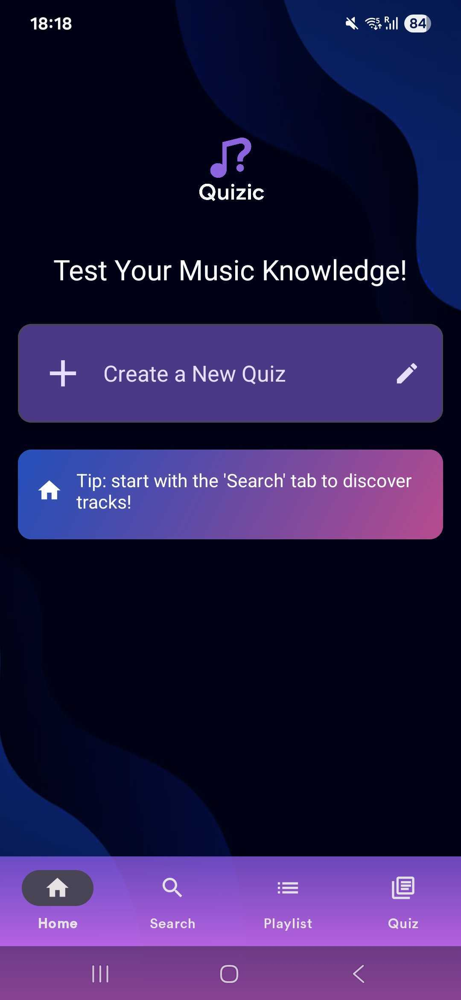

### Search Screen

The **Search** screen allows users to discover music by querying the Deezer API. Users can search for
tracks or albums using a radio button filter. Search results are shown in a scrollable list (via RecyclerView), and each item
displays key information such as track name, artist, album cover and in case of a track, the album name. Tapping on a search result
navigates to the Details screen for that track or album.
When doing a long click on a track, a menu appears with the options to add the track to a playlist or create a new playlist.

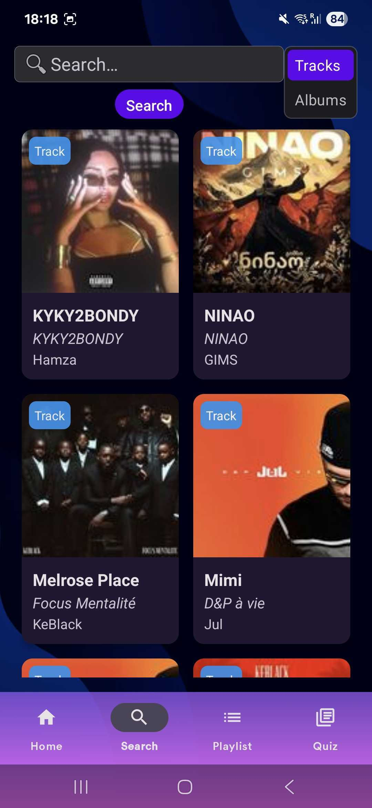 
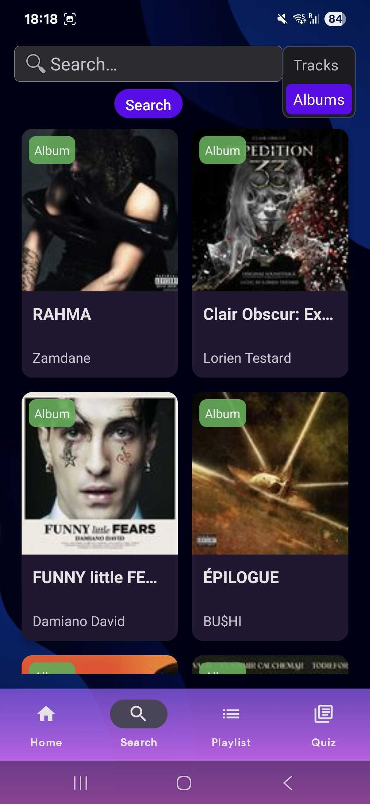 
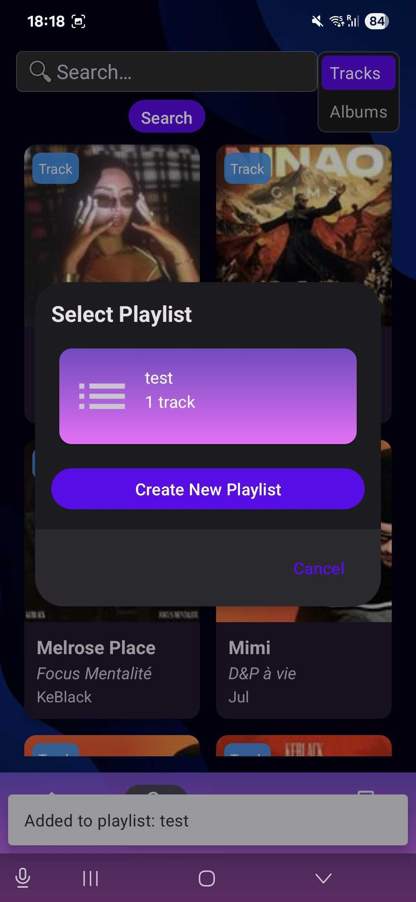

### Details Screen

The **Details** screen presents information about a selected track or album. For a **track** , it shows the title,
artist, album art, and duration along with a 30-second audio preview and an "Add to Playlist"
button. For an **album** , it displays the album art, and a tracklist with the title, artist, duration and a play preview button as well as a button to add all tracks of the album to a playlist.

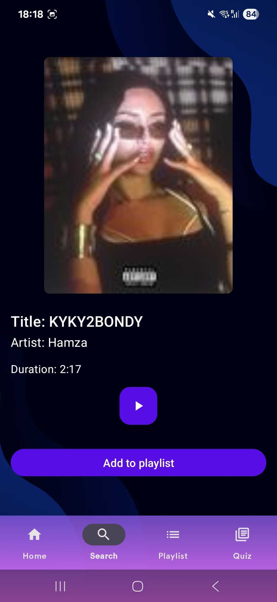 
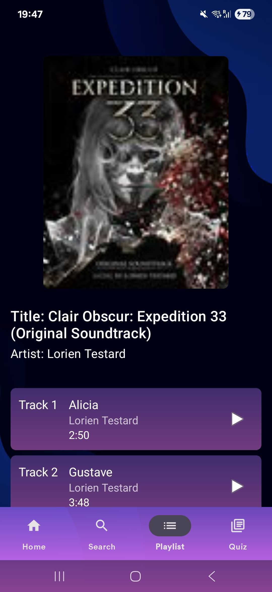

### Quiz Screen

The **quiz** is created by the user by selecting a playlist and a number of questions. The questions are generated by the app by selecting a random track from the playlist and then selecting a random question type such as "Guess the artist from the song preview" or "Guess the album from the song preview". Once in the question a player can launch the preview. We decided to diverge a bit from the specs given in the instructions and decided to have quizzes in a list with information about the quiz and a button to launch the quiz when cliking it or deleting it as we thought it would be smoother and more user friendly.
There is also a fill the gap question type where the user has to fill the gap in the artist name for example. 
We also implmemented a custom timer per question.

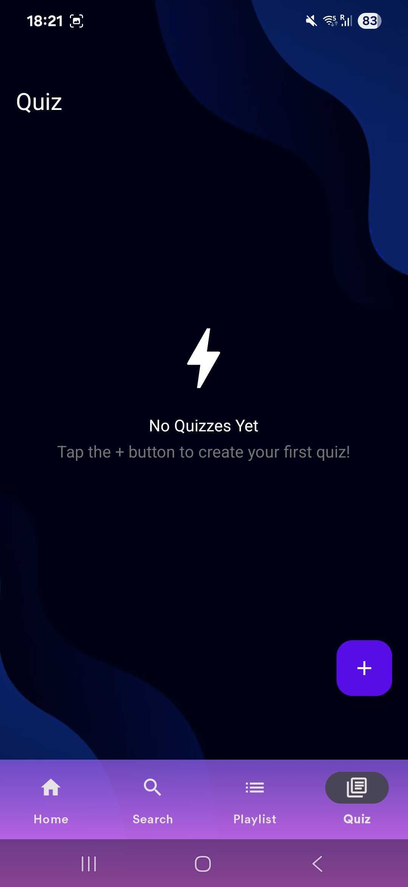
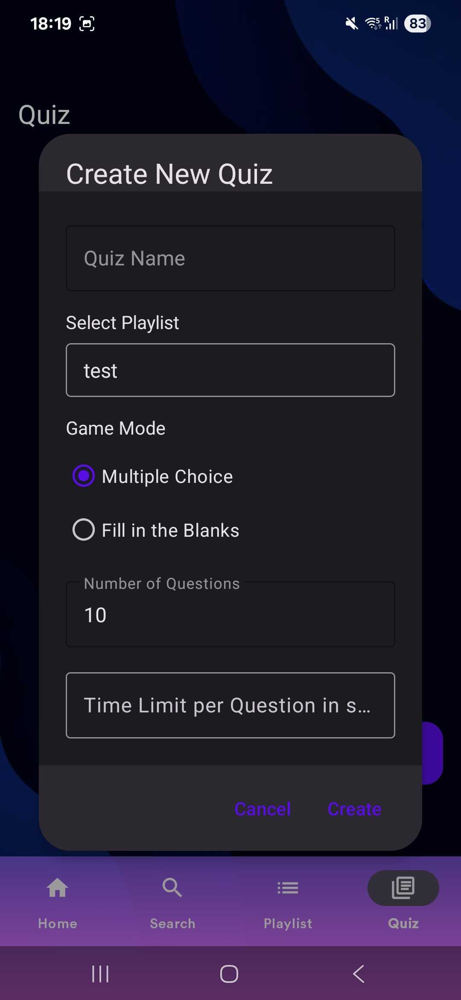
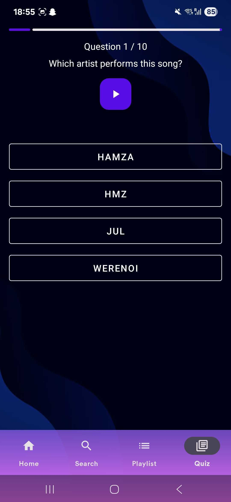

### Playlists Screen

The **Playlists** screen lists all of the user's playlists. Each playlist item shows its name ,a cover image and the number of tracks in the playlist as well as total duration. The name can be edited by clicking the edit button or the playlist entirely deleted.
Tapping a playlist opens the Playlist Details view, which displays the playlist's name, description, and the
full list of tracks it contains. In the details, users can delete a track from the playlist or play a preview. They can also acces the details of the tracks in the playlist.
We also added a button to sort according to A-Z or Z-A , Duration(shortest to longest or longest to shortest) and number of tracks(ascending or descending).

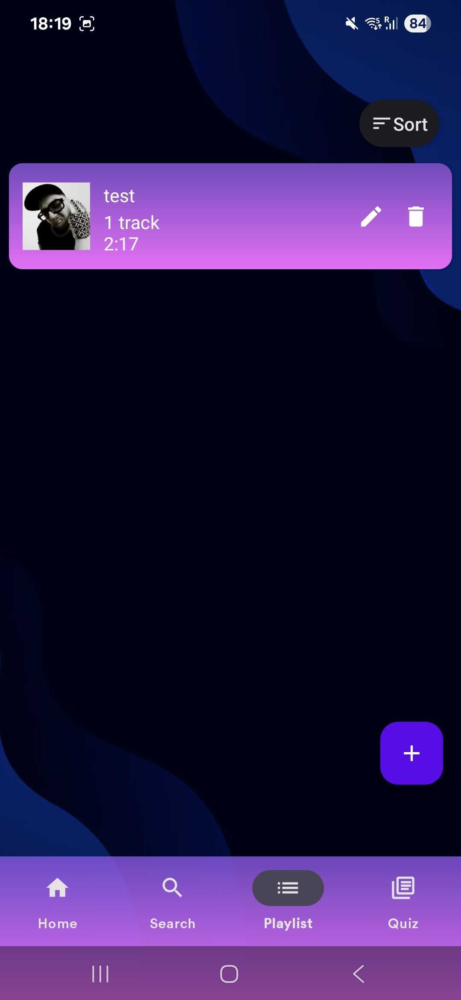
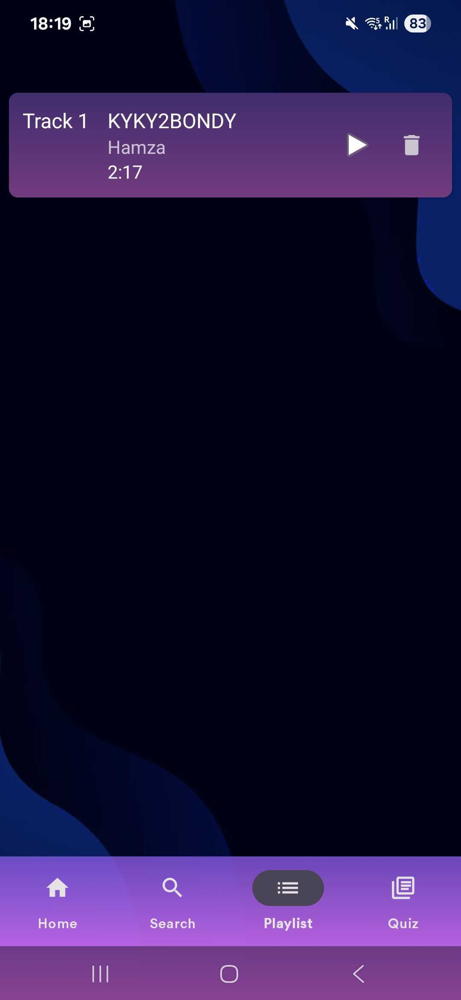

## Architecture, Design Decisions and Implementation Choices

The app follows a **Model-View-ViewModel (MVVM)** architecture, chosen for its clear separation of concerns and lifecycle management. This architecture is particularly well-suited for our music quiz application because:
- It handles configuration changes (like screen rotation) gracefully while playing music
- Provides a clean way to manage UI state and data operations
- Enables efficient testing through ViewModel isolation

### UI Layer
The UI layer consists of:
- **Fragments**: Handle user interactions and display data
  - `SearchFragment`: Implements search functionality with pagination and filtering
  - `DetailsFragment`: Shows track/album details with preview playback
  - `PlaylistFragment`: Manages playlist creation and modification
  - `QuizFragment`: Handles quiz creation and gameplay
  - `HomeFragment`: Displays playlist previews and quick access
- **Adapters**: Efficiently display data in RecyclerViews
  - `TrackAdapter`: Displays search results and playlist tracks
  - `AlbumAdapter`: Shows album search results
  - `PlaylistAdapter`: Manages playlist list display
  - `QuizAdapter`: Handles quiz list and question display
  - `PlaylistSelectionAdapter`: Manages playlist selection for adding tracks

### ViewModel Layer
ViewModels manage UI state and business logic:
- **TracksViewModel**: 
  - Handles search operations and track/album filtering
  - Manages pagination for search results
  - Observes search results through LiveData
- **PlaylistViewModel**:
  - Manages playlist CRUD operations
  - Handles track addition/removal
  - Maintains playlist metadata (duration, track count)
  - Uses Flow for real-time playlist updates
- **QuizViewModel**:
  - Generates and manages quiz questions
  - Handles quiz state and scoring
  - Manages audio preview playback during quizzes
  - Implements quiz state restoration
- **DetailsViewModel**:
  - Manages track/album details
  - Handles preview playback
  - Manages playlist addition operations
  - Coordinates with PlaylistViewModel for track addition

### Data Layer
The data layer consists of two main components:

#### Deezer API Integration
- **DeezerApiInterface**: RESTful API client built with Retrofit
  - Chosen for its type-safe API calls and efficient HTTP client
  - Provides comprehensive music data access
  - Handles pagination and error cases
- **RetrofitInstance**: Singleton providing API access
  - Ensures single instance of API client
  - Configures base URL and response parsing
  - Uses Gson for JSON conversion

#### Local Database (Room)
- **AppDatabase**: Central database instance
  - Provides type-safe database access
  - Manages database versioning
  - Handles database migrations
  - Implements singleton pattern for database access
- **DAOs**: Data Access Objects for database operations
  - `PlaylistDao`: Manages playlist operations with Flow support
  - `PlaylistTrackDao`: Handles playlist-track relationships
  - `QuizDao`: Manages quiz data with transaction support
  - `QuizQuestionDao`: Handles quiz questions with random selection

### Implementation Choices

#### Asynchronous Operations
- **Coroutines**: Used for asynchronous operations
  - `viewModelScope`: Manages coroutine lifecycle in ViewModels
  - `Dispatchers.IO`: Handles database operations
  - Parallel track fetching for better performance
  - Quiz generation and state management
  - Error handling with try-catch blocks

- **Flow**: Implemented for reactive data streams
  - Room DAOs expose Flow for real-time updates
  - Handles playlist and quiz data changes
  - Provides efficient data streaming
  - Used in combination with LiveData for UI updates

#### State Management
- **LiveData**: Core component for state observation
  - Lifecycle-aware UI updates
  - Automatic configuration change handling
  - Efficient state management for music playback
  - Used for loading states and error handling

#### Data Flow
Data flows through the app following the pattern: **UI → ViewModel → Data Sources**
- User actions trigger ViewModel operations
- ViewModels coordinate between UI and data sources
- Data sources (API/Database) provide data to ViewModels
- ViewModels update UI state through LiveData
- Error handling at each layer with appropriate user feedback

### Design and UI Choices
- **Material Design**: Provides consistent visual language
  - Material3 components and themes
  - Custom color scheme with dark mode support
  - Consistent typography with custom fonts
- **Layout Components**:
  - CoordinatorLayout for complex scrolling behaviors
  - RecyclerView for efficient list display
  - MaterialCardView for content containers
  - BottomNavigationView for main navigation
- **Visual Elements**:
  - Background images with proper contrast
  - Custom gradients for navigation bar
  - Responsive layouts for different screen sizes
  - Consistent padding and margins

## Architecture Diagram

### Project Structure
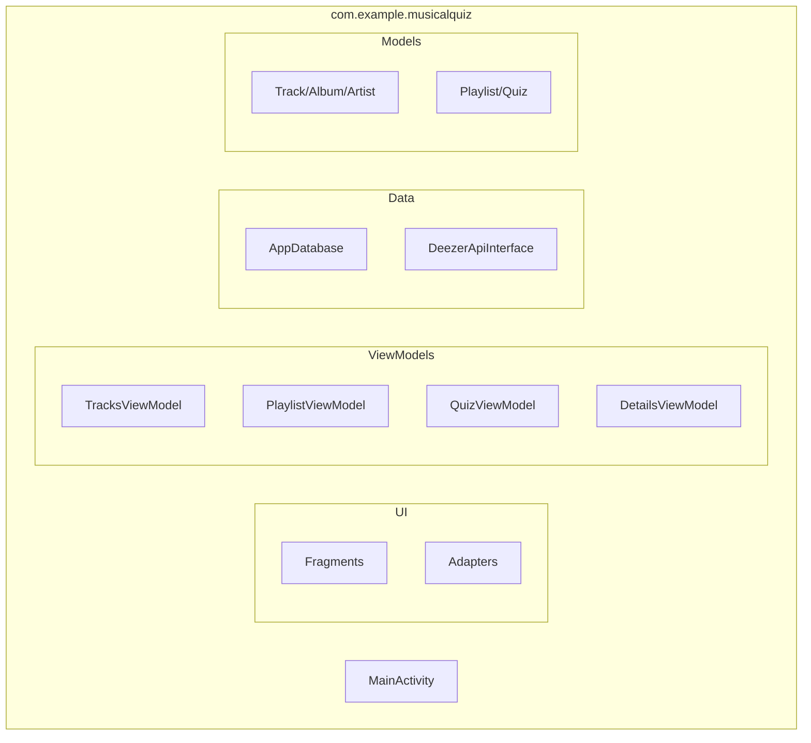

### Component Interaction
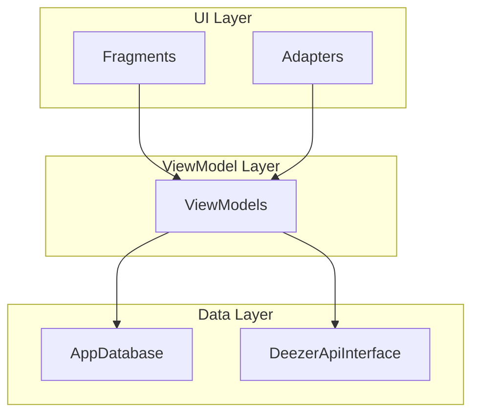

### Repository Pattern Implementation
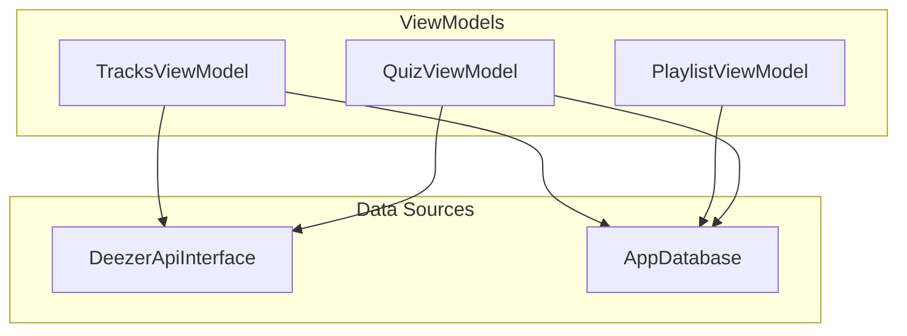

### Repository Implementation

The application uses a robust repository pattern to manage data flow between the UI and data sources:

#### Data Sources
- **Deezer API Integration**
  - RESTful API client built with Retrofit
  - Comprehensive interface (`DeezerApiInterface`) supporting:
    - Track and album search with pagination
    - Top charts retrieval
    - Detailed track and album information
    - Album track listings
  - Response handling with generic `DeezerSearchResponse<T>` wrapper

#### Local Database (Room)
- **Entity Structure**
  - `Playlist`: User-created playlists with metadata
  - `PlaylistTrack`: Junction table for playlist-track relationships
  - `Quiz`: Quiz configurations and metadata
  - `QuizQuestion`: Individual quiz questions and answers

- **Data Access Objects (DAOs)**
  - `PlaylistDao`: CRUD operations for playlists
  - `PlaylistTrackDao`: Managing playlist-track relationships
  - `QuizDao`: Quiz management with transaction support
  - `QuizQuestionDao`: Question handling with random selection

#### Data Flow Architecture
1. **Search and Discovery**
   - ViewModel (`TracksViewModel`) manages search state
   - Handles pagination and filtering between tracks/albums
   - Caches search results for offline access

2. **Playlist Management**
   - `PlaylistViewModel` orchestrates playlist operations
   - Supports adding tracks/albums to playlists
   - Maintains track counts and durations
   - Handles playlist metadata (artist covers, durations)

3. **Quiz Generation**
   - `QuizViewModel` manages quiz creation and execution
   - Fetches track details from Deezer API
   - Generates questions based on game mode
   - Maintains quiz state and scoring

#### Data Synchronization
- Automatic playlist track updates
- Local storage of playlists and quiz data
- Transaction support for atomic operations
- Note: Offline caching and background synchronization are planned future improvements

### Asynchronous Operations
- **Coroutines**: Used extensively for asynchronous operations
  - `viewModelScope` for structured concurrency in ViewModels
  - `Dispatchers.IO` for database operations
  - `withContext` for thread switching
  - Parallel track fetching in playlists
  - Quiz generation and state management

- **Flow**: Implemented for reactive data streams
  - Room DAOs expose Flow for real-time updates of:
    - Playlists and their tracks
    - Quiz questions and state
    - Track counts and durations
  - Flow operators used:
    - `collectLatest` for real-time UI updates
    - `first`/`firstOrNull` for one-time data fetching
  - Flow conversion from LiveData for seamless integration

### State Management
- **LiveData**: Core component for state observation
  - Loading states for UI feedback
  - Error handling and user notifications
  - Data updates and UI synchronization
  - Configuration change survival

### Data Flow Architecture
Data flow in the app follows: **UI ➔ ViewModel ➔ Repository ➔ Data Sources** (API + Room). 

When the user takes an action (e.g. enters a search query or navigates to a quiz), the Fragment calls a ViewModel
function. The ViewModel then calls a repository method, which may fetch data from Room or make a
network request. The repository returns results (or cached data) to the ViewModel, which updates its
LiveData fields. The Fragment observes these LiveData fields and updates the UI automatically.

### Implementation Choices

```
MutableLiveData / LiveData: 
- Chosen for its lifecycle-aware nature, ensuring UI updates only occur when the fragment is active
- Prevents memory leaks by automatically handling lifecycle events
- Perfect for our music app where we need to handle configuration changes (like screen rotation) while playing music
- Enables automatic UI updates when data changes (e.g., when a track is added to a playlist)
- Provides consistent state management across the app

RecyclerView: 
- Selected for efficient handling of large music collections
- Memory-efficient for displaying long lists of tracks and albums
- Smooth scrolling performance even with album artwork loading
- View recycling is crucial for our app's performance when displaying search results and playlist contents
- Supports different layout managers for flexible UI arrangements

BottomNavigationView: 
- Implemented for intuitive navigation between core features (Home, Search, Quiz, Playlists)
- Follows Material Design guidelines for primary navigation
- Provides clear visual feedback for current section
- Essential for our app's structure where users frequently switch between different music-related features
- Maintains consistent navigation state across app restarts

Room database: 
- Chosen for robust local storage of user-created content
- Provides type-safe SQL queries, reducing runtime errors
- Enables offline access to playlists and quiz data
- Perfect for our app's need to persist user playlists and quiz progress
- LiveData integration allows real-time UI updates when data changes
- Transaction support for atomic operations (e.g., quiz creation)

Repository Pattern: 
- Implemented to centralize data operations
- Simplifies switching between local and remote data sources
- Essential for our app's architecture where we need to handle both local (Room) and remote (Deezer API) data
- Provides consistent error handling and loading states
- Enables efficient data synchronization

Other Libraries:
- Retrofit/OkHttp: Selected for efficient API calls to Deezer, with built-in caching and error handling
- Coroutines: Used for asynchronous operations, particularly important for our music playback and quiz features
- View Binding: Implemented for type-safe view access, reducing boilerplate code
- Glide: Chosen for efficient image loading and caching of album artwork
```

### Design and UI choices:
```
- Material Design theme with dark mode support
  - Consistent visual language across the app
  - Better readability and reduced eye strain
  - Modern and professional appearance

- Custom font implementation
  - Enhanced readability and brand identity
  - Consistent typography across the app
  - Better visual hierarchy

- Custom color scheme
  - Brand-specific colors for recognition
  - Accessible color combinations
  - Consistent visual feedback

- Background image integration
  - Enhanced visual appeal
  - Better user engagement
  - Maintains readability with proper contrast
```

## Unresolved Issues and Future Improvements

```
- Offline caching: Currently the app does not cache search results or playlist contents; every
search query fetches fresh data from the API. We could add an offline cache using Room so
that users can see recent results and playlists without an internet connection.

- Quiz coroutines: The quiz logic (loading questions, shuffling options) is not fully optimized. We
intend to refactor quiz handling using Kotlin coroutines better for asynchronous operations, improving
responsiveness.

- Quiz sorting/options: At present, quizzes are not sortable in their list. We could add a sorting option to make the quizzes more customizable.
sorting or selecting quiz categories (by Game mode, number of questions, etc.) to make the quizzes more customizable.

- UI polish: Some UI elements need visual refinement. We could do more coherent differences between dark and light mode..

- Performance optimizations: We have noticed occasional delays updating the UI via LiveData
and coroutines.
```

## Contributions

- **WALTZING Loïc**: 
  - Core Architecture & Navigation:
    - Implemented the MVVM architecture pattern throughout the app
    - Set up the initial structure
    - Set up the bottom navigation system and navigation graph
    - Created the Room database with entities and DAOs
    - Integrated LiveData for reactive UI updates
  - UI Implementation:
    - Built the SearchFragment with track/album filtering and search functionality using RecyclerView
    - Created the PlaylistFragment with playlist management features
    - Implemented the Details screens for tracks and albums
    - Refined some elements of the Quizlist UI
  - Data Management:
    - Integrated the Deezer API using Retrofit
    - Implemented playlist CRUD operations
    - Set up track and album data models
    - Created the repository layer for data operations
  - UI/UX Refinements:
    - Implemented Material Design components
    - Refined overall UI for consistency
  - Final report:
    - Wrote the final report.

- **KARDAVA Elene**:
  - UI Implementation:
    - Developed the HomeFragment with playlist previews and quick access featur
  - Quiz System:
    - Designed and implemented the complete quiz feature
    - Created the quiz data models and relationships
    - Implemented the quiz generation algorithm
    - Built the quiz playback system
  - Database Design:
    - Designed the quiz-related database schema
    - Created relationships between quizzes, questions, and answers
    - Implemented data querying for quiz content
  - UI/UX Design:
    - Led the overall app design and styling
    - Created consistent color schemes and themes
  - Quiz Features:
    - Built the quiz creation interface
    - Implemented the quiz gameplay mechanics
    - Created the scoring system
    - Added timer per question


